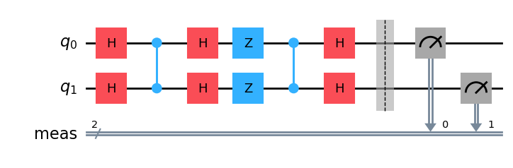
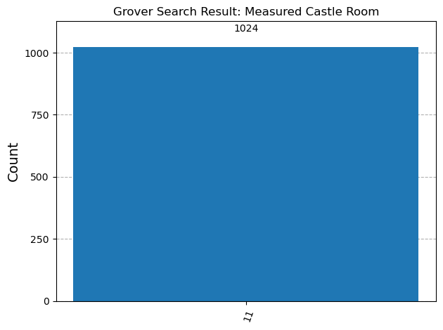
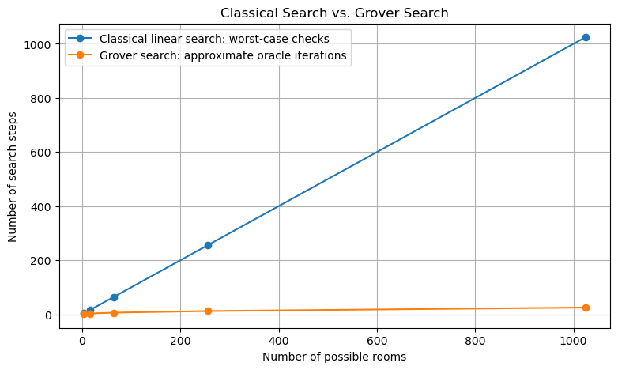

# Hybrid Classical–Quantum Search Demo

## Understanding Grover's Algorithm Through a Castle-Room Example

| Project Information | Details |
|---|---|
| **Prepared by** | **Swarup Sudulaganti** |
| **Designation** | **Professor, AI & DS** |
| **LinkedIn** | [linkedin.com/in/sudulaganti](https://www.linkedin.com/in/sudulaganti/) |
| **Implementation** | Python, Qiskit, Qiskit Aer and Jupyter Notebook |

A beginner-friendly Qiskit teaching project that explains Grover's quantum-search algorithm through a simple castle-room analogy.

## Project Idea

Imagine that a prince enters a castle to find a treasure hidden inside one of four rooms.

A classical linear search opens the rooms one by one. In the worst case, it checks all four rooms.

The quantum demonstration represents the four rooms using two qubits:

| Binary state | Castle room |
|---|---|
| `00` | Room 0 |
| `01` | Room 1 |
| `10` | Room 2 |
| `11` | Room 3 — Treasure Room |

The quantum circuit then:

1. creates an equal superposition of the four room states;
2. uses an oracle to mark the treasure state `|11⟩`;
3. applies a diffusion operator to amplify the marked state's probability;
4. measures the qubits;
5. uses classical Python code to interpret the measured result.

The overall workflow is:

> **Classical preparation → Quantum processing → Classical interpretation**

## Final Result

The local ideal simulator returns:

```text
Measurement counts:
{'11': 1024}

Hybrid Search Result
--------------------
Most frequently measured state: 11
Interpreted classical result: Room 3 — Treasure Room
```

### Final Grover Circuit



### Measurement Histogram



## Learning Objectives

After completing the notebook, learners should be able to:

- explain classical linear search using a simple example;
- represent four possible states using two qubits;
- describe the role of Hadamard gates in creating superposition;
- explain how an oracle marks a target state through a phase change;
- understand diffusion as inversion around the average amplitude;
- connect interference with amplitude amplification;
- measure a quantum circuit using a local simulator;
- identify the classical and quantum stages of a hybrid workflow;
- distinguish query-complexity improvement from real execution-time benchmarking.

## Search-Complexity Comparison

For an unstructured-search problem with `N` possible items:

| Search method | Approximate search-query complexity |
|---|---|
| Classical linear search | `O(N)` |
| Grover's quantum search | `O(√N)` |



This chart compares search steps or oracle calls. It does **not** compare actual execution time on a computer. The notebook uses a classical local simulator to reproduce ideal quantum-circuit behaviour.

## Repository Structure

```text
hybrid-classical-quantum-search-demo/
│
├── README.md
├── PROJECT_SUMMARY.md
├── TEACHING_GUIDE.md
├── requirements.txt
├── environment.yml
├── .gitignore
├── LICENSE
│
├── notebooks/
│   └── 01_hybrid_classical_quantum_search_demo.ipynb
│
└── assets/
    ├── 01_superposition_circuit.png
    ├── 02_oracle_circuit.png
    ├── 03_diffusion_circuit.png
    ├── 04_final_grover_circuit_with_measurement.png
    ├── 05_grover_search_result_histogram.png
    └── 06_classical_vs_grover_search.png
```

## How to Run the Notebook

### Option 1: Use an Existing Conda Environment

Activate an environment that already contains Qiskit and Jupyter:

```bash
conda activate qcenv
jupyter notebook
```

Open:

```text
notebooks/01_hybrid_classical_quantum_search_demo.ipynb
```

Run the cells from top to bottom.

### Option 2: Create a New Conda Environment

```bash
conda env create -f environment.yml
conda activate hybrid-qc-search-demo
jupyter notebook
```

### Option 3: Install with pip

```bash
pip install -r requirements.txt
jupyter notebook
```

## Tested Environment

The notebook was tested successfully with:

```text
Qiskit version: 2.3.1
Qiskit Aer version: 0.17.2
Matplotlib version: 3.10.8
```

## Teaching Use

This repository is designed for an introductory classroom demonstration. The notebook follows a step-by-step sequence:

1. classical linear search;
2. room-state encoding;
3. superposition;
4. oracle marking;
5. diffusion and amplitude amplification;
6. measurement;
7. classical interpretation;
8. scaling comparison;
9. practice questions and reflection.

A separate [Teaching Guide](TEACHING_GUIDE.md) provides a suggested session plan, discussion prompts and common misconceptions.

## Scope and Limitations

This is intentionally a small educational demonstration.

It uses:

- two qubits;
- one marked state;
- the target state `|11⟩`;
- a manually constructed oracle;
- one Grover iteration;
- an ideal local simulator.

It does not benchmark real quantum hardware. Practical quantum-computing workflows must also consider oracle design, circuit depth, hardware noise and error rates.

## Future Extensions

Possible follow-up activities include:

- modifying the oracle to mark `|00⟩`, `|01⟩` or `|10⟩`;
- exploring larger search spaces;
- comparing ideal and noisy simulations;
- running a suitable circuit on quantum hardware;
- using Qiskit's reusable Grover-operator utilities after understanding the manual circuit.

## Prepared By

**Swarup Sudulaganti**  
**Professor, AI & DS**  
LinkedIn: [linkedin.com/in/sudulaganti](https://www.linkedin.com/in/sudulaganti/)

## References

- [IBM Quantum Documentation — Grover's algorithm](https://quantum.cloud.ibm.com/docs/tutorials/grovers-algorithm)
- [IBM Quantum Learning — Grover algorithm](https://quantum.cloud.ibm.com/learning/courses/utility-scale-quantum-computing/grovers-algorithm)
- [Qiskit Aer Tutorial — Simulators](https://qiskit.github.io/qiskit-aer/tutorials/1_aersimulator.html)
